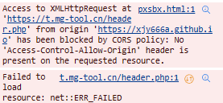

#### [[中文]](README.md)                   [[English]](ENREADME.md)

#### 开源网页：[mg工具网开源库导航](https://xjy666a.github.io/xjyweb-Onlinetoolwebsite/)

# MG工具网

[MG工具网](https://t.mg-tool.cn/)是一个提供多种在线工具的网站,涵盖了游戏娱乐、文字处理、网络与系统、日期与时间、汉字与语言、生活实用、数学与计算、编程相关、密码相关、娱乐社交、个人发展、AI与创作、地理与地图、游戏相关、多媒体等多个领域。

## 功能介绍

该网站提供以下主要功能:

| 名称 | 介绍 | 开源 | 类型 |
| --- | --- | --- | --- |
| 扫雷 | 经典扫雷游戏 | ✅ | 游戏娱乐 |
| 剪刀石头布 | 剪刀石头布游戏 | ✅ | 游戏娱乐 |
| 坤坤打砖块 | 坤坤打砖块游戏 | ✅ | 游戏娱乐 |
| 数学计算小游戏 | 数学计算小游戏 | ✅ | 游戏娱乐 |
| 文本加密 | 加密解密文本 | ✅ | 文字处理 |
| 英语与数字语转换 | 英语和数字语言之间的相互转换 | ✅ | 文字处理 |
| 记事本 | 简易记事本 | ✅ | 文字处理 |
| HTML可视化编辑 | 可视化编辑HTML | ✅ | 文字处理 |
| 重复内容查询 | 查询两段文本的重复内容 | ✅ | 文字处理 |
| IP查询 | 查询IP地址的位置和信息 | ❌ | 网络与系统 |
| 系统信息查询 | 系统信息查询(仅PC可用) | ✅ | 网络与系统 |
| Whois查询 | 查询网站的Whois | ❌ | 网络与系统 |
| 历史上的今天 | 查看历史上的今天发生的事件 | ❌ | 日期与时间 |
| 日期和BMI等计算 | 计算日期、BMI等 | ✅ | 日期与时间 |
| 计时器,倒计时和闹钟 |  | ✅ | 日期与时间 |
| 汉字信息查询 | 查询汉字的释义、笔画、结构等信息 | ❌ | 汉字与语言 |
| 简繁转换 | 将文字转换为简体或繁体 | ❌ | 汉字与语言 |
| 垃圾分类查询 |  | ❌ | 生活实用 |
| 身份证相关 | 生成、测试身份证号 | ❌ | 生活实用 |
| 人民币小写转大写 |  | ❌ | 生活实用 |
| 二维码生成 |  | ❌ | 生活实用 |
| 计算器 | 进行数学计算 | ✅ | 数学与计算 |
| 单位换算 | 在线单位换算 | ✅ | 数学与计算 |
| 随机数生成器 | 生成随机数字 | ✅ | 数学与计算 |
| 圆周率查询 | 查询圆周率100万内有没有指定数字 | ✅ | 数学与计算 |
| 三角形面积计算 | 计算三角形面积 | ✅ | 数学与计算 |
| 圆形扇形周长面积计算 | 计算圆形和扇形面积周长 | ✅ | 数学与计算 |
| 平行四边形面积计算 |  | ✅ | 数学与计算 |
| 24点计算和生成 |  | ✅ | 数学与计算 |
| 贷款利息计算 |  | ✅ | 数学与计算 |
| Python代码在线编辑、运行 |  | ✅ | 编程相关 |
| UUID生成和各进制转换 |  | ✅ | 编程相关 |
| 摩斯电码转换 |  | ✅ | 编程相关 |
| 短链接生成 | 生成短链接、防红链接 | ❌ | 编程相关 |
| 密码生成和密码泄露检测 | 密码自定义生成、保存,还有自动的密码泄露检测,需会员 | ❌ | 密码相关 |
| 密码泄露检测(普通版) | 查询你的密码是否在全球5亿的已泄露密码中,密码生成中有高级版,但需会员 | ❌ | 密码相关 |
| 今日热点查询 | 查询今日热点,来源百度和今日头条 | ❌ | 娱乐社交 |
| 喜报/悲报生成 |  | ❌ | 娱乐社交 |
| 语音生成 | 能生成丁真等的语音 | ❌ | 娱乐社交 |
| 性取向测试 |  | ✅ | 个人发展 |
| 个人压力测试 |  | ✅ | 个人发展 |
| 画图 | 简易在线画图 | ✅ | AI与创作 |
| AI画图 | AI画图生成图片 | ❌ | AI与创作 |
| AI聊天(目前无上下文) | AI聊天,目前AI不会记住之前的聊天记录 | ❌ | AI与创作 |
| AI对话(高级版) | AI对话,Copilot | ❌ | AI与创作 |
| Markdown编辑器 | 可视化Markdown编辑器 | ❌ | AI与创作 |
| 国家首都查询 |  | ✅ | 地理与地图 |
| 我国历史朝代 |  | ✅ | 地理与地图 |
| 天气查询 |  | ❌ | 地理与地图 |
| 标准地图 | 标准中国地图和世界地图,天地图支持 | ❌ | 地理与地图 |
| MC问答 | 测试你是否玩懂MC,来源:mcwiki | ✅ | 游戏相关 |
| mcUUID,皮肤,披风查询 | 查询minecraft玩家的UUID、披风和皮肤 | ✅ | 游戏相关 |
| MC命名空间查询 |  | ✅ | 游戏相关 |
| QQ音乐解析和下载 | 解析并下载QQ音乐内的音频和歌词 | ❌ | 多媒体 |
| 永远点不到的按钮 |  | ✅ | 其他 |
| 点击mg慢速版 |  | ✅ | 其他 |
| 点击mg快速版 |  | ✅ | 其他 |
| 网站地图生成 | 网站sitemap生成 | ✅ | 其他 |

## 接口文档

该项目的接口文档可通过 https://ux05jeo2fk.apifox.cn/doc-4294028/?nav=1 访问,记录了能提供可能需要与后端通信的功能接口。

## 开源说明

该项目部分功能为开源,部分功能为闭源,具体请查看上文表格中标注的'❌'的功能。开源部分使用MIT许可协议[【LICENSE】](LICENSE)。

## 常见问题

如果出现上面所示错误，请无视，因为Github Page不支持php，所以这里引入头文件会报错，如果你想看这个的头文件的样子，请访问[https://t.mg-tool.cn/header.php](https://t.mg-tool.cn/header.php)查看
该头文件源代码：[header.php](header.php "header.php")

## 如何贡献

如果你希望为该项目做出贡献,可以:

1. 克隆本仓库到本地
2. 创建新分支并在其上进行修改
3. 提交代码并发起Pull Request
4. 等待项目维护者审核

欢迎大家一起参与,让这个工具网站越来越强大!
